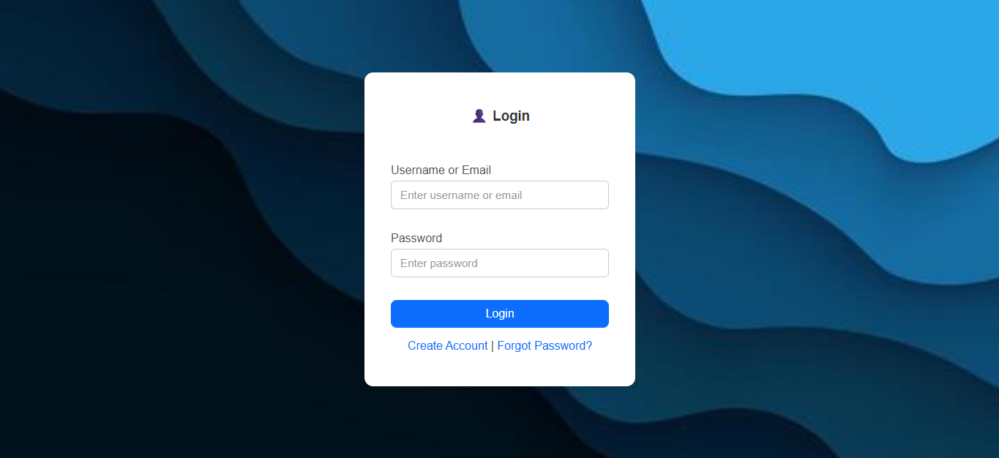
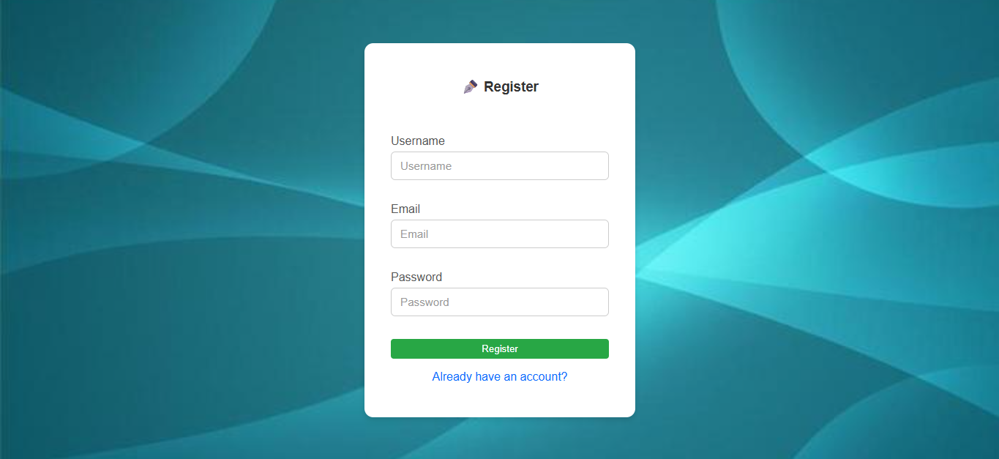
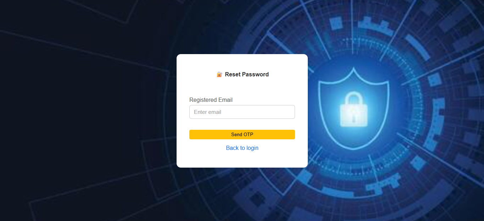
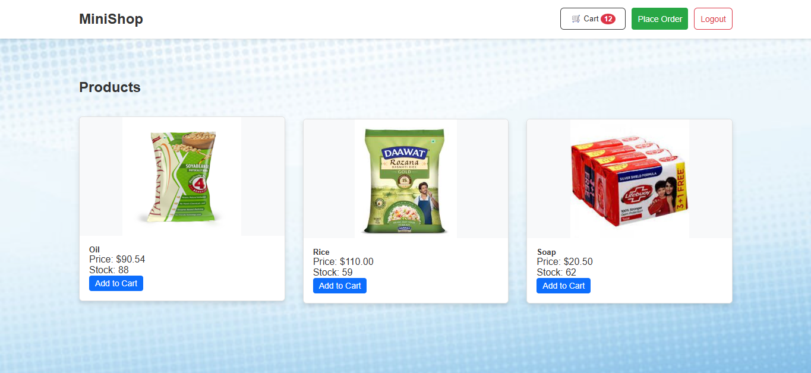
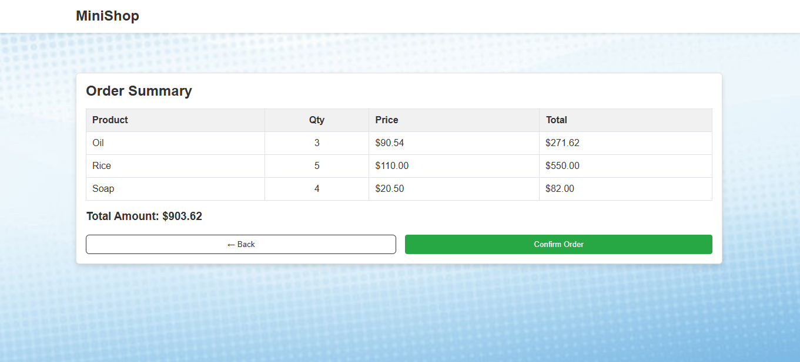

# Mini E-Commerce Web Application

A mini full-stack e-commerce web application built using **Python
(Flask)** and **MySQL**.\
This project demonstrates real-world backend architecture,
authentication, database design, and frontend integration.

------------------------------------------------------------------------

## 🚀 Features

-   Product listing with stock information
-   Add to cart functionality
-   Cart quantity tracking
-   Order summary before confirmation
-   Order placement and cart clearing
-   Product stock update after order
-   Session-based authentication
-   Protected cart and order operations
-   RESTful backend APIs
-   Clean separation of frontend, backend, and database layers

------------------------------------------------------------------------

## 🛠️ Tech Stack

**Backend** - Python - Flask - Flask-CORS

**Database** - MySQL

**Frontend** - HTML - JavaScript - CSS

**Tools & Concepts** - REST APIs - Session-based authentication -
Environment variables - Git & GitHub - Modular backend architecture

------------------------------------------------------------------------

## 📂 Project Structure

    backend/
      app/
        routes/        -> API routes
        services/      -> Business logic
        config.py      -> Application configuration
        extensions.py  -> Flask extensions
      run.py           -> Application entry point

    frontend/
      templates/       -> HTML templates
      static/          -> CSS and JavaScript files

    database/
      schema.sql       -> Database schema
      db_config.py     -> Database connection

    requirements.txt
    README.md

------------------------------------------------------------------------

## 📸 Screenshots

- **Login Page**  


- **Register Page**  


- **Forgot Password Page**  


- **Dashboard / Products**  


- **Order Summary Page**  


------------------------------------------------------------------------

## 🗄️ Database Schema (Summary)

### Products Table

-   id
-   name
-   price
-   stock
-   created_at

### Cart Table

-   id
-   user_id
-   product_id
-   quantity
-   created_at

### Orders Table

-   id
-   user_id
-   total_amount
-   created_at

### Order Items Table

-   id
-   order_id
-   product_id
-   quantity
-   price

### Users Table

-   id
-   username
-   email
-   password_hash
-   is_verified
-   created_at

### Email OTP Table

-   id
-   email
-   otp
-   type
-   expires_at
-   created_at

------------------------------------------------------------------------

## ▶️ How to Run Locally

### 1️⃣ Clone the repository

``` bash
git clone https://github.com/SubhanduG/mini-ecommerce-flask.git
cd mini-ecommerce-flask
```

### 2️⃣ Create virtual environment

``` bash
python -m venv venv
```

### 3️⃣ Activate virtual environment

**Windows**

``` bash
venv\Scripts\activate
```

**Linux / macOS**

``` bash
source venv/bin/activate
```

### 4️⃣ Install dependencies

``` bash
pip install -r requirements.txt
```

### 5️⃣ Configure environment variables

Create a `.env` file in the project root:

``` env
DB_HOST=localhost
DB_USER=root
DB_PASSWORD=your_password
DB_NAME=ecommerce_db
SECRET_KEY=dev-secret-key
```

### 6️⃣ Setup database

Run SQL from `database/schema.sql`.

### 7️⃣ Run application

``` bash
python backend/run.py
```

Open browser:

    http://127.0.0.1:5000

------------------------------------------------------------------------

## 🔐 Security Notes

-   Database credentials are not hardcoded
-   Environment variables are used for sensitive data
-   Session-based authentication is implemented
-   Passwords are stored in hashed form
-   Protected APIs require user login

------------------------------------------------------------------------

## 🎓 Learning Outcomes

-   Designing REST APIs using Flask
-   Structuring backend applications using routes and services
-   Database relationships and SQL joins
-   Implementing authentication and access control
-   Handling real e-commerce flows (cart and orders)
-   Integrating frontend JavaScript with backend APIs
-   Managing configuration securely using environment variables

------------------------------------------------------------------------

## 🔮 Future Improvements

-   Payment gateway integration
-   User-based order history
-   Admin product management
-   Improved UI and UX
-   Cloud deployment

------------------------------------------------------------------------

## 👤 Author

**Subhandu Ghosh**\
MSc Computer Science\
Python Backend & Full-Stack Developer\
